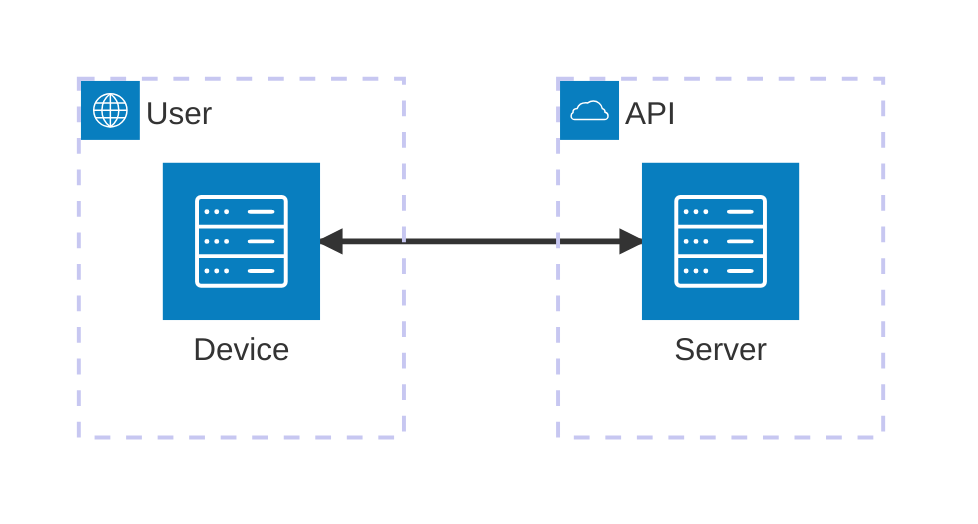

# Contributing Guidelines

Thank you for your interest in contributing to the Agentic AI Banking Playbook project.

This project is an applied, exploratory initiative to demonstrate how Agentic AI can address practical banking challenges. All contributions are welcome, provided they align with the principles and structure outlined below.

## How to Contribute

- **Ideas & Suggestions:**
  - Open an issue or discussion for new use-cases, improvements, or feedback.
  - Suggest new demonstrators or enhancements to existing ones.

- **Code Contributions:**
  - Fork the repository and create a new branch for your changes.
  - Ensure your code is clear, well-documented, and follows best practices.
  - Add or update documentation as needed.
  - Submit a pull request with a clear description of your changes.

- **Data & Ethics:**
  - Only use synthetic or public data in your contributions.
  - Do not include any confidential, proprietary, or personal data.
  - Respect ethical AI development principles.

- **Reporting Issues:**
  - Use the issue tracker to report bugs, request features, or ask questions.

## Code of Conduct

All contributors are expected to follow the [Contributor Covenant Code of Conduct](https://www.contributor-covenant.org/).

## Design & Documentation Standards

All architectural diagrams for this project should be created using [Mermaid architecture-beta diagrams](https://mermaid.js.org/syntax/architecture-beta.html).

- Diagrams should be embedded directly in relevant `.md` files  
- Keep diagrams simple, modular, and aligned to the evolving design  
- Avoid external image files — Mermaid ensures everything is version controlled  

### Example

### Mermaid Icons

Github supports auto-rendering these basic mermaid icons `cloud`, `database`, `disk`, `internet` and `server`.

---

Thank you for helping to improve and grow the project.
