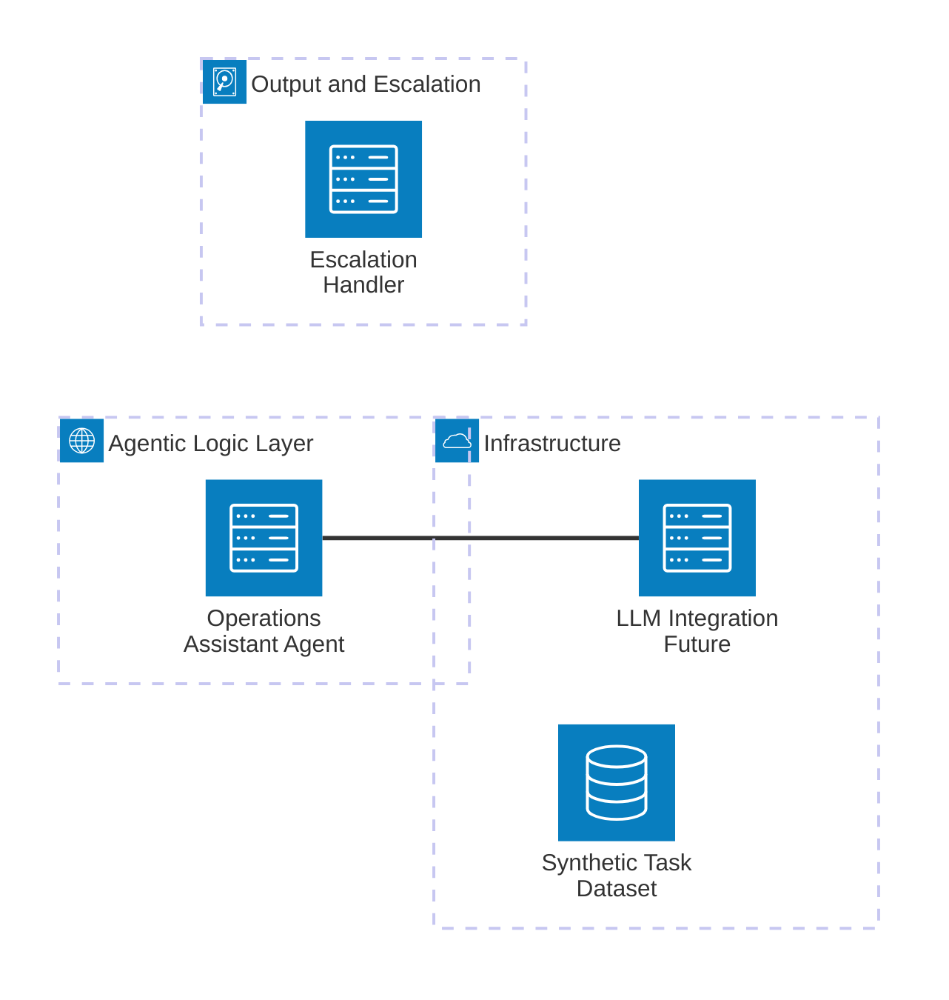

# Agentic Operations Assistant — Design & Architecture

This document outlines the initial design thinking and architecture for the Agentic Operations Assistant demonstrator.

## Overview

The Agentic Operations Assistant is intended to autonomously handle basic operational tasks, including:

- Routing tasks to the appropriate teams or queues  
- Triaging based on priority or complexity  
- Escalating exceptions or risks to humans  

The design prioritises modularity and future integration with tools such as Vertex AI or FinLLM.

## High-Level Architecture
